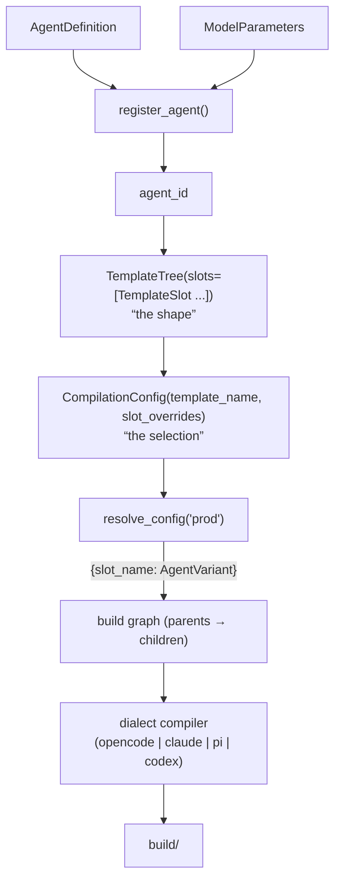

# Registry and compilation

This page walks the pipeline that turns Pydantic definitions into runnable
agent trees on disk: registry → template → config → resolution → build graph
→ dialect compiler → `build/`.

The whole thing in one picture:



??? note "Text version of this diagram"

    ```
     AgentDefinition ─┐
     ModelParameters ─┴─▶ register_agent() ──▶ agent_id
                                                 │
     TemplateTree(slots=[TemplateSlot ──────────┘ ])   "the shape"
                            │
     CompilationConfig(template_name, slot_overrides)   "the selection"
                            │
                  resolve_config("prod")
                            │  {slot_name: AgentVariant}
                  build graph (parents → children)
                            │
                  dialect compiler (opencode | claude | pi)
                            │
                         build/
    ```

## Layer 1: agents — `register_agent`

```python
from open_agent_compiler import AgentRegistry, ModelParameters

reg = AgentRegistry()
agent_id = reg.register_agent(
    "greeter", greeter_definition,
    ModelParameters(model_name="anthropic/claude-sonnet-4-5", temperature=0.7),
)
```

Registration pairs a definition with model parameters and returns a stable
`agent_id` of the form `{name}_{model}_t{temperature}` (e.g.
`greeter_anthropic_claude-sonnet-4-5_t0.7`). The model is part of the
identity on purpose: registering the same definition under two models yields
two distinct agent_ids, which is what lets multi-model fleets coexist in one
registry. Duplicate ids raise immediately.

Sibling registration methods:

- **`register_agent_with_preset(name, defn, preset)`** — binds a rich
  `ModelPreset` (provider, sampling, limits, `provider_options`) instead of
  bare `ModelParameters`; the preset *name* joins the id discriminator, so
  two presets sharing a model_id still produce distinct agents.
- **`register_with_improvements(name, defn, params, model_class=...,
  client_id=...)`** — merges any promoted improvement snapshots into the
  baseline before registering. No snapshot = baseline passes through, so the
  same call works on fresh and tuned projects alike. This is the hook that
  makes the [improvement loop](../guides/improvement-loop.md) persistent.
- **`register_mock_profile(profile)`** — names a `MockProfile` that tests
  and builds can bind (see [Testing](../guides/testing.md)).

## Layer 2: shape — `TemplateTree` and `TemplateSlot`

```python
from open_agent_compiler import TemplateSlot, TemplateTree

reg.register_template(TemplateTree(
    name="default",
    slots=[
        TemplateSlot(name="primary", default_agent_id=orch_id),
        TemplateSlot(name="critic",  default_agent_id=critic_id),
    ],
))
```

A slot is a **named position in a deployment**, decoupled from which agent
fills it. Slots — not agents — are what the dialect compiles to files: one
slot, one `<slot-name>.md`. Two rules give slots their meaning:

- The slot named **`primary`** compiles with `mode: primary` (directly
  invocable); every other slot compiles as a subagent, reachable only via
  dispatch from a parent.
- **`also_compile_as_primary=True`** on a slot emits a second
  `<name>-primary.md` twin forced to primary mode — useful when a subagent
  must also be invocable directly (subagents can't be; the twin can).

Orchestrator/subagent wiring is a two-sided contract: the orchestrator's
definition lists `subagents=[AgentHeader(agent_id=critic_id, ...)]` (which
renders dispatch instructions into its prompt), and the tree gives that same
agent a slot (which makes the file exist). Miss the first and the parent
never delegates; miss the second and it delegates into a void.

## Layer 3: selection — `CompilationConfig`

```python
from open_agent_compiler import CompilationConfig

reg.create_compilation_config(CompilationConfig(
    name="prod", template_name="default",
))
reg.create_compilation_config(CompilationConfig(
    name="cheap", template_name="default",
    slot_overrides={"critic": cheap_critic_id},
))
```

A config names a template plus per-slot overrides, so `prod`, `ci`, and
`cheap` select different agents into the *same* shape. Overrides accept `*`
wildcards matched against registered agent_ids. Validation is eager
(`strict_validation=True` by default): a config referencing a missing
template or agent id raises at `create_compilation_config` time — this is
the "errors at registration, not runtime" promise in practice.

`resolve_config("prod")` returns `{slot_name: AgentVariant}` — each variant a
copy carrying the config's postfix, the slot-derived mode, and the
`also_compile_as_primary` flag. You rarely call it yourself; `CompileScript`
does.

## The build graph

Before writing anything, the compiler orders slots with
`open_agent_compiler/compiler/build_graph.py`: it maps every variant's
subagent references back to slot names, builds a parent → child dependency
graph, and emits a topological order (**orchestrators first, subagents
last**). Two failure modes surface here rather than at runtime:

- **Cycles** (`find_cycles`) — a subagent dispatching back to its own
  orchestrator is almost always a design error; compilation raises with the
  cycle spelled out.
- **Orphan references** (`find_orphan_subagent_refs`) — a `subagents` entry
  whose agent_id has no slot in the resolved tree, i.e. the "delegating into
  a void" mistake above.

## Dialect compilers

`CompileScript` is the single entry point:

```python
from pathlib import Path
from open_agent_compiler.compiler.script import CompileScript

CompileScript(
    target=Path("build"), factory=my_registry_factory,
    config="prod", dialect="opencode", clean=True,
).run()
```

The `dialect` string is looked up in
`open_agent_compiler/compiler/dialects/registry.py`, which auto-registers
`opencode`, `claude`, and `pi`. Dialects are pluggable — subclass `Compiler`
and `register("mydialect", MyCompiler)`. Unknown dialect names fail at
`CompileScript` *construction*, before any work happens.

What lands in `build/` per dialect:

| | `opencode` | `claude` | `pi` |
|---|---|---|---|
| Agent files | `build/.opencode/agents/*.md` | `build/.claude/` tree (same shape) | `build/.pi/agents/*.md` |
| Tool scripts | `build/scripts/` + bundled infra (`subagent_todo.py`, `workspace_io.py`, `opencode_manager.py`) | `build/scripts/` | `build/scripts/` (per-tool only, no bundled infra) |
| Permissions | frontmatter `permission:` block + `tool:` toggles | equivalent | `tools:` allowlist + `disallowed_tools:` |
| Subagent spawn | Task tool / `opencode_manager.py` | Task tool | `Agent()` tool |

Each `.md` is YAML frontmatter (description, model, mode, permissions) over
the rendered prompt body. Per-dialect specifics live in
[opencode](../dialects/opencode.md), [claude-code](../dialects/claude-code.md),
and [pi](../dialects/pi.md).

Extra `CompileScript` knobs worth knowing now: `variants=[VariantSpec, ...]`
compiles the same tree once per model with postfixed filenames
(`orch-glm.md`, `orch-qwen.md` — see
[Variants and profiles](../guides/variants-and-profiles.md));
`access_profile` / `mock_profile` select resource vs mock bindings;
`clean_strategy="per_variant"` scopes cleaning during multi-pass builds.

The CLI wraps the same pipeline: `oac compile agents:registry --config prod
--target build --dialect pi`, where `agents:registry` is any
`module:callable` returning an `AgentRegistry`.

Next: [Execution tiers](execution-tiers.md) — the other thing a registry can
produce besides files.
