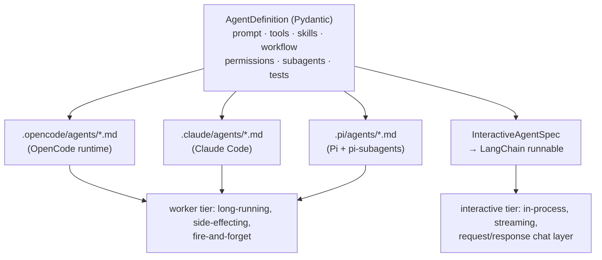

# open-agent-compiler — All-in-One Guide

Everything on one page: defining, compiling, running, testing, and
auto-improving agents with `open-agent-compiler`. If you prefer
focused, step-by-step pages, start with
[Your First Agent](getting-started/first-agent.md), the
[concept pages](concepts/philosophy.md), and the
[tutorials](tutorials/index.md) instead — this page is the reference
version of the same material.

---

## 1. What this framework is

You define agents **once**, as typed Python (Pydantic models) — system
prompts, tools, skills, workflows, permissions, subagents, tests. The
framework then turns that single definition into whatever a runtime
needs:



??? note "Text version of this diagram"

    ```
                            ┌────────────────────────────────────────────┐
                            │        AgentDefinition (Pydantic)          │
                            │  prompt · tools · skills · workflow ·      │
                            │  permissions · subagents · tests           │
                            └──────────────┬─────────────────────────────┘
                                           │
                ┌───────── worker tier ────┼──────────┐        ┌─ interactive tier ─┐
                ▼                          ▼          ▼        ▼                    │
       .opencode/agents/*.md    .claude/agents/*.md  .pi/agents/*.md   InteractiveAgentSpec
       (OpenCode runtime)       (Claude Code)        (Pi + pi-subagents)  → LangChain runnable
                │                          │          │        │
                └──────────────┬───────────┴──────────┘        │
                               ▼                               ▼
                  long-running, side-effecting,      in-process, streaming,
                  fire-and-forget "workers"          request/response chat layer
    ```

(The worker tier also compiles to `.codex/agents/*.toml` for the OpenAI
Codex CLI — omitted from the diagram for width.)

Around that core sit:

- **`oac` CLI** — scaffold projects, compile, introspect, test, improve,
  promote.
- **Embedded testing** — capability/tool/agent tests defined next to the
  agents, run with mocks so CI never needs credentials.
- **Improvement loop** — mutate prompts/parameters, evaluate, keep the
  frontier, snapshot winners, promote them into the next compile.
- **Scaffolding** — `oac init` generates a ready-to-run project (from
  barebones up to a per-client personalized SaaS shape).
- **Developer skill bundles** — `oac sync-skills` installs markdown
  skills into `.opencode/skills/` and `.claude/skills/` so the coding
  agents working *on* your project know how to use the framework.

### The two tiers, and when to use which

| | **Worker** (compiled dialect) | **Interactive** (binding) |
|---|---|---|
| Emits | `.opencode/` / `.claude/` / `.pi/` / `.codex/` agent trees | an in-process `InteractiveAgentSpec` → LangChain runnable |
| Tools bind to | bash / JSON emission inside a coding-agent runtime | native tool-calling |
| Contract | fire-and-forget, side-effects, returns a handle | streaming, request/response, returns a value |
| Latency profile | seconds-to-minutes, autonomous | sub-second first token, conversational |
| Use it for | long, testable, autonomous tasks | the dynamic / chat layer |

A typical app uses **both**: the interactive agent holds the
conversation and dispatches a worker (compiled to opencode/pi) that
runs in the background to completion and communicates by side-effects.
Both tiers are derived from the *same* `AgentDefinition` — that is the
unified interface.

---

## 2. Installation & setup

Requirements: Python ≥ 3.12.

```bash
pip install open-agent-compiler
# or
uv add open-agent-compiler
oac --help
```

For development on the framework itself, clone the repo and use
[uv](https://docs.astral.sh/uv/):

```bash
git clone https://github.com/DehydratedWater/OpenAgentCompiler
cd OpenAgentCompiler
uv sync            # installs the framework + dev deps
uv run pytest -q   # ~1300 tests, all green, no credentials needed
```

Projects scaffolded by `oac init` depend on the published
`open-agent-compiler` package; when the running `oac` comes from a
source checkout, the scaffold also adds a `[tool.uv.sources]` entry
pointing back at that checkout so it tracks your local framework.

Optional extra for the interactive tier:

```bash
uv sync --extra langchain    # langchain-core + langchain-openai
```

---

## 3. Quick start

### 3a. Scaffold a project (recommended)

```bash
uv run oac init myproj --template barebones --llm anthropic \
    --skills opencode,claude
cd myproj
cp .env.example .env         # fill in real keys
uv run python build_agents.py
cd build && opencode run --agent primary "Hi"
```

`oac init` templates:

| Template | What you get |
|---|---|
| `barebones` | agent registry + `build_agents.py` compile script |
| `web` | + FastAPI service (`app/`) + Docker |
| `full` | + telegram bot + Postgres (SQLAlchemy async + Alembic) |
| `saas-personalized` | per-client auto-optimization SaaS: intake/personalize/serve endpoints, personalization module, mocked per-client tests (ship green) |

Useful flags: `--dialect {opencode,claude,pi}` (what the generated
`build_agents.py` compiles to), `--with-postgres`, `--with-sqlite`
(starter ScriptTool + AccessProfile), `--with-mcp-server`,
`--with-redis`, `--with-qdrant`, `--with-telegram-bot`, `--with-cron`,
`--observability langfuse`, `--proxy nginx|traefik`, `-i` for
interactive prompts. `--no-uv-sync` skips the automatic dependency
install.

### 3b. Or define an agent by hand

```python
# agents/registry.py
from open_agent_compiler import (
    AgentDefinition, AgentHeader, AgentRegistry,
    CompilationConfig, ModelParameters,
    TemplateSlot, TemplateTree,
)

def registry() -> AgentRegistry:
    reg = AgentRegistry()

    greeter = AgentDefinition(
        header=AgentHeader(
            agent_id="greeter",
            name="greeter",
            description="Friendly one-line greeter.",
        ),
        usage_explanation_long="Greets users warmly, one sentence.",
        usage_explanation_short="greets",
        system_prompt="You are a friendly greeter. Reply in one sentence.",
    )
    agent_id = reg.register_agent(
        "greeter", greeter,
        ModelParameters(model_name="anthropic/claude-sonnet-4-5", temperature=0.7),
    )
    reg.register_template(TemplateTree(
        name="default",
        slots=[TemplateSlot(name="primary", default_agent_id=agent_id)],
    ))
    reg.create_compilation_config(
        CompilationConfig(name="prod", template_name="default"),
    )
    return reg
```

Compile it — from Python:

```python
from pathlib import Path
from open_agent_compiler.compiler.script import CompileScript
from agents.registry import registry

CompileScript(
    target=Path("build"),
    factory=registry,
    config="prod",
    dialect="opencode",   # or "claude" or "pi"
    clean=True,
).run()
```

…or from the CLI (works from the project root, no install needed):

```bash
uv run oac compile agents:registry --config prod --target build            # opencode
uv run oac compile agents:registry --config prod --target build --dialect pi
uv run oac info --dialects     # lists: claude, codex, opencode, pi
uv run oac info agents:registry
```

---

## 4. Core concepts

The registry is a three-layer indirection that keeps *what an agent is*
separate from *where it runs*:

1. **`AgentDefinition`** — the full behavioral definition (prompt,
   tools, skills, workflow, permissions, subagents, tests). Registered
   under a name with `ModelParameters` → yields an `agent_id`.
2. **`TemplateTree` / `TemplateSlot`** — the *shape* of a deployment: a
   named set of slots (e.g. `primary`, `helper`, `critic`), each with a
   default agent id. Slots are what the dialect compiles to files.
3. **`CompilationConfig`** — a named selection of template (+ per-slot
   overrides), so `prod`, `ci`, `cheap` can pick different agents into
   the same tree.

Key `AgentDefinition` fields (all optional unless noted):

| Field | Purpose |
|---|---|
| `header` *(required)* | `AgentHeader(agent_id, name, description)` |
| `usage_explanation_long/short` *(required)* | human/agent docs; long form is the body fallback when no prompt/workflow |
| `system_prompt` | the core prompt (prepended before the workflow when both are set) |
| `prompt_sections` | named, individually-optimizable sections; `system_prompt` is re-derived from them on promotion |
| `workflow` | list of `WorkflowStepDefinition` — see §7 |
| `todo_mode` | `strict` / `lazy` / `none` progress tracking |
| `workspace` | working-directory convention (`{name}` interpolated) |
| `extra_tools` | `ToolDefinition`s — bash tools and/or JSON ScriptTools |
| `skills` | `SkillDefinition`s compiled into prompt + frontmatter |
| `subagents` | `AgentHeader`s this agent may spawn |
| `tool_permissions` | `ToolPermissions(read/write/edit/mcp)` booleans |
| `mcp_servers` | `MCPServerDefinition`s with per-server tool allowlists |
| `model_class` | routing key for `SplitProfile` (see §9) |
| `agent_tests` / `capability_tests` / `tool_tests` | embedded tests (see §10) |

(`also_compile_as_primary` — emitting a directly-invocable `-primary`
twin for a subagent — is a `TemplateSlot` field, set where the agent is
placed in the tree, not on the definition itself.)

---

## 5. Compiling: dialects

`CompileScript` is the single compile entry point:

```python
CompileScript(
    target=Path("build"),          # output dir
    factory=registry,              # or factory_spec="agents:registry"
    config="prod",                 # CompilationConfig name
    dialect="opencode",            # opencode | claude | pi | codex | <registered>
    clean=True,                    # or clean_strategy="per_variant"
    variants=[...],                # optional multi-pass (see §9)
    access_profile="prod",         # optional resource bindings (see §6)
    mock_profile=None,             # optional mock bindings for CI
    client_id=None,                # per-tenant personalized builds
    dry_run=False, verbose=True,
).run()
```

What each dialect emits:

| | `opencode` (default) | `claude` | `pi` | `codex` |
|---|---|---|---|---|
| Agent files | `.opencode/agents/*.md` | `.claude/` tree | `.pi/agents/*.md` | `.codex/agents/*.toml` + `AGENTS.md` index |
| Tool scripts | `scripts/` + bundled infra (`subagent_todo.py`, `workspace_io.py`, `opencode_manager.py`) | scripts | `scripts/` (per-tool only) | `scripts/` (per-tool only) |
| Permissions | `permission:` block + `tools:` toggles | equivalent | `tools:` allowlist + `disallowed_tools:` frontmatter | `sandbox_mode` (read-only / workspace-write) |
| Subagent spawn | Task tool; primary-mode via `opencode_manager.py` | Task tool | `Agent()` tool (pi-subagents) — single mechanism | natural-language delegation (no spawn tool) |
| Todos | `todoread`/`todowrite` | equivalent | `TODO.md` conventions | `TODO.md` conventions |
| MCP | `permission.mcp.<name>` per server | equivalent | **not mapped** — compile warning, configure `ext:mcp/<tool>` manually | `[mcp_servers.<name>]` for url servers; stdio warns |

Dialects are pluggable — register your own:

```python
from open_agent_compiler.compiler.dialects.registry import register
register("mydialect", MyCompiler)   # subclass open_agent_compiler.compiler.core.compiler.Compiler
```

See [pi-agent-dialect.md](./dialects/pi.md) for the full pi
mapping, [the codex dialect page](./dialects/codex.md) for the Codex
mapping, and `examples/80_pi_agents/build_both.py` for compiling the
same tree to two runtimes side by side.

---

## 6. Tools

### Bash tools

Declared with `ToolDefinition(header=..., bash_tool=ToolDefinitionLogicBash(...))`
— the compiled prompt documents the command, positive/negative examples,
and the permission layer allowlists it.

### JSON ScriptTools

A `ToolDefinition` with `json_tool=ToolDefinitionLogicJson(...)` carries
`tool_scripts` — actual script files (inline `script_contents` or a
`source_file_path`) that the compiler writes into the build tree's
`scripts/`. The runtime side subclasses `ScriptTool[InModel, OutModel]`:

```python
from pydantic import BaseModel
from open_agent_compiler.runtime import ScriptTool

class NoteIn(BaseModel):
    text: str

class NoteOut(BaseModel):
    ok: bool

class NotesTool(ScriptTool[NoteIn, NoteOut]):
    name = "notes_db"
    description = "Persist a note."
    def execute(self, input: NoteIn) -> NoteOut:
        ...  # real work
        return NoteOut(ok=True)
```

**Surface exact command verbs in the prompt.** Compiled agents flail
(wrong `--command` verbs, `ls` + `--help` exploration) unless the prompt
names the exact verbs a ScriptTool accepts — derive them from the tool's
dispatch enum and inject them into the tool docs.

### Mocks and AccessProfiles

Every tool can carry a `MockResponse` (`fixed` / `echo` / `callable`),
and compile-time `mock_profile` / `access_profile` names select which
binding a build uses:

- **AccessProfile** — binds named resources per environment (prod =
  real Postgres, ci = in-memory SQLite) via `ResourceHandle`s.
- **MockProfile** — per-tool mock overrides so `oac test` runs
  everything green without credentials.

See `examples/30_tools`, `examples/32_multi_turn_mocks`,
`examples/33_sqlite_resources`.

---

## 7. Workflows, subagents, permissions

### Workflow steps

```python
from open_agent_compiler.model.core.agent_model import WorkflowStepDefinition
from open_agent_compiler.model.core.workflow_model import Criterion, Route

WorkflowStepDefinition(
    id=2,
    name="ReviewDraft",
    instructions="Assess the draft against the brief.",
    evaluates=(
        Criterion(name="quality",
                  question="Is the draft good enough to ship?",
                  possible_values=("yes", "no")),
    ),
    routes=(Route(criteria_name="quality", value="no", goto_step=1),),
    subagents=("critic",),          # spawned at this step
    marks_done=("draft-reviewed",), # todo bookkeeping
    # gate=GateDefinition(...)      # conditional execution
)
```

The dialect renders steps as numbered prompt sections with criteria,
conditional routes, tool notes, subagent invocation snippets, and (in
`strict` todo mode) an explicit STEP-0 task-list bootstrap plus
per-step completion marks.

### Subagents

List them as `AgentHeader`s on `defn.subagents`, reference them from
steps by name, and give each its own slot in the `TemplateTree` so it
compiles alongside the parent. `mode="subagent"` (default) spawns via
the runtime's Task/`Agent()` tool; `mode="primary"` (opencode only)
invokes via the bundled `opencode_manager.py`. See
`examples/40_subagents`, `examples/50_primary_dispatch`.

### Permissions & SECURITY POLICY

`tool_permissions=ToolPermissions(read=..., write=..., edit=..., mcp=...)`
compiles to *both* the runtime's enforcement config (opencode
`permission:` block / pi `disallowed_tools:`) *and* a SECURITY POLICY
prompt section, keeping enforcement and agent awareness in sync.
Per-server MCP allowlists via `mcp_servers=[MCPServerDefinition(name="slack",
allowed_tools=[...])]` (opencode/claude only; pi warns).

---

## 8. Skills

Two distinct things share the word "skill":

1. **Agent skills** (`AgentDefinition.skills`) —
   `SkillDefinition(name, description, usage_explanation_long, workflow_steps,
   positive_examples, ...)` compiled into the agent's prompt and
   frontmatter. They teach the *compiled agent* a capability.
2. **Developer skill bundles** (`oac sync-skills`) — 14 opinionated
   markdown skills installed into a *project's* `.opencode/skills/` and
   `.claude/skills/` so coding agents (OpenCode, Claude Code) working
   in that repo know the framework: `getting-started`,
   `authoring-agents`, `authoring-tools`, `writing-tests`,
   `providers-and-models`, `variants-and-profiles`,
   `interactive-agents`, `improvement-loop`, `docker-and-compose`,
   `project-orchestration`, and more.

```bash
uv run oac sync-skills . --skills opencode,claude   # deploy / refresh
uv run oac sync-skills . --check                    # drift report
```

`oac init --skills opencode,claude` deploys them at scaffold time.

---

## 9. Variants & split profiles (multi-model fleets)

### VariantSpec — same tree, N models, one compile

```python
from open_agent_compiler import VariantSpec, ModelPreset, SamplingDefaults

specs = [
    VariantSpec(name="claude", postfix="-claude",
                preset=ModelPreset(name="c", provider="anthropic",
                                   model_id="claude-sonnet-4-5",
                                   sampling=SamplingDefaults(temperature=0.7))),
    VariantSpec(name="glm", postfix="-glm",
                preset=ModelPreset(name="g", provider="zai-coding-plan",
                                   model_id="glm-4.5-air",
                                   sampling=SamplingDefaults(temperature=0.7))),
]
CompileScript(target=Path("build"), factory=registry, config="prod",
              variants=specs).run()
```

Each pass appends its `postfix` to every compiled file — the runtime
picks a variant at invocation time.

### SplitProfile — preset per `model_class` within one pass

```python
from open_agent_compiler import SplitProfile

split = SplitProfile(
    name="split", postfix="-split",
    preset=deep_preset,                       # fallback
    class_map={"fast": fast_preset,           # quick acks
               "analytical": deep_preset},    # reasoning
    default_class="analytical",
)
```

Agents opt in with `AgentDefinition(model_class="fast")`. This is how a
fleet routes cheap slots to a local vLLM model and hard slots to a
frontier model in a single compile.

### CompilationContext — flags without globals

`current_context().flag("is_local")` inside agent factories lets one
registry branch per variant (local tools vs prod tools) without global
state.

---

## 10. Testing

Tests live **on the definitions** and run with `uv run oac test`:

```bash
uv run oac test agents:registry --config prod
uv run oac test agents:registry --config prod --kind tool --filter notes
```

| Kind | Model | What it checks |
|---|---|---|
| capability | `CapabilityTest` | pure introspection of the compiled artifact: `must_have_tools`, `must_not_have_tools`, `must_have_skills`, … |
| tool | `ToolTest` | drives a tool handler (or its mock) with `input`, asserts on output; `mock_profile` selects bindings |
| agent | `AgentTest` | end-to-end scenario (single- or multi-turn) with `expected_tool_calls` + `evaluators`; needs an invoker callable since execution is deployment-specific |

Results append to `.oac/test_results.jsonl`; a green-hash cache skips
unchanged tests (`--force` bypasses). Design rule: **every tool ships a
mock**, so the whole suite is runnable in CI with zero credentials.

---

## 11. The improvement loop

The framework's differentiator: agents are **optimizable components**.

```bash
uv run oac improve agents:registry \
    --target primary --config prod \
    --criteria criteria.yaml \
    --mutators identity,prompt-suffix:"Be terse.",llm-prompt-rewriter \
    --evaluator myproj.evals:score \
    --max-iters 3 --frontier 3 --output ./improved

uv run oac promote ./improved/<winner>.json   # → .oac/promoted/
uv run python build_agents.py                  # next compile picks it up
```

The loop: mutate → compile → evaluate → keep the frontier → snapshot.
Bundled mutators: `identity` (control), `prompt-prefix:<text>`,
`prompt-suffix:<text>`, `temperature:<delta>`, `llm-prompt-rewriter`
(an LLM rewrites the prompt against your criteria). The Python API
(`IterativeLoop`, `run_fleet`, `build_branch_loop`,
`contract_gate`/`require_tool_called`/`require_artifact` outcome
contracts) supports per-agent *and* per-branch loops, LLM judges, and
fleet runs across model variants.

Promotion is section-aware: if a definition uses `prompt_sections`, the
promoted snapshot re-derives `system_prompt` from the improved sections,
so per-section gains persist across compiles.

Practical notes from real fleets:

- Run improvement with **workers=2** against local vLLM; infra timeouts
  must be *skipped*, not scored 0, or they poison the scoreboard.
- Stochastic agents need multi-sample evaluation.
- Namespace parallel per-model loops (ws/ports/snapshots/DB) so N
  models tune concurrently.

See `examples/20_optimization_run`, `25_per_model_optimization`,
`26_promote_and_reload`, `27_composable_improvements`.

---

## 12. The interactive tier (LangChain binding)

For the chat/streaming layer, derive an in-process spec from the *same*
definition:

```python
from open_agent_compiler import build_interactive_spec
from open_agent_compiler.interactive.bindings.langchain_binding import bind

spec = build_interactive_spec(agent=my_agent, live_profile=LIVE_PROFILE)
runnable = bind(spec, tool_runner=my_tool_runner)   # streaming LCEL runnable

for chunk in runnable.stream({"messages": [("user", "make it punchier")]}):
    ...
```

`build_interactive_spec` renders the agent's core intent (prompt +
workflow-as-guidance + skills-as-capabilities) **without** the worker
scaffolding (bash/todo/security blocks) because interactive tools bind
natively. `SplitProfile` gives workers and the live tier different
providers from one registry (e.g. workers on zai-coding-plan via
opencode, live tier on a local OpenAI-compatible vLLM). The
framework-owned tool loop (`open_agent_compiler.interactive.runner`) records
`ToolCallRecord`s so interactive runs are scoreable by the same
improvement loop.

Local-model tip: Qwen3.x via vLLM needs `enable_thinking=false` (or
structured output), otherwise `content` comes back empty.

An alternative realtime binding exists for PydanticAI
(`bindings/pydantic_ai_binding.py`, extra `[pydantic-ai]`) — same
spec, same ToolRunner/event contracts, native `output_type` support.

### Per-target adaptation (harness × model)

The loop generalizes beyond one model class: `run_per_target_loops`
runs one loop per `(harness, model_class)` target — opencode / pi /
codex / claude via `build_compiled_evaluator` + pluggable
`HarnessRunner`s, plus the in-process `interactive` tier via
`build_interactive_evaluator`. Winners promote into per-target slots
(`oac promote --target pi+fast`; resolution target → class → default),
history records to the SQLite run store (`.oac/improvement.db`,
`open_store()`), and `oac versions` manages what's loaded. Full story:
[optimization targets](guides/optimization-targets.md);
offline-runnable capstone: `examples/85_matrix_live_chat/`.

---

## 13. `oac` CLI reference

| Command | Purpose |
|---|---|
| `oac init <dir> [--template ...] [--dialect ...] [-i]` | scaffold a project (see §3a) |
| `oac compile <factory> --config C --target D [--dialect X] [--clean] [--dry-run]` | compile a registry |
| `oac info <factory>` / `oac info --dialects` | introspect registry / list dialects |
| `oac test <factory> --config C [--kind K] [--filter S] [--force]` | run embedded tests |
| `oac improve <factory> --target T --config C [...]` | run the improvement loop |
| `oac promote <snapshot.json> [--class L] [--target K]` | stage a snapshot for the next compile (per-class / per-target slots) |
| `oac versions <action> <component> [...]` | browse / load / unload / rollback autolooped versions; `apply-source` rewrites the Python prompt |
| `oac sync-skills <dir> [--skills opencode,claude,pi,codex] [--check]` | deploy/refresh developer skills |

`oac compile` also accepts `--native-tools` (emit the harness's native
tool-calling form — TS shims for opencode, an MCP tools server for
claude/codex; see [native tool calling](guides/native-tools.md)).

`<factory>` is always `module:callable` returning an `AgentRegistry`;
the CWD is on the import path, so `agents:registry` works from a
project root.

---

## 14. Examples index

All examples run end-to-end against real LLMs (see `examples/README.md`).

| Example | Shows |
|---|---|
| `00_hello` | minimum working agent |
| `10_multi_provider` | one agent, three providers via variants |
| `20_optimization_run` → `27_composable_improvements` | improvement loop, per-model optimization, promote/reload, composition |
| `28_context_blocks`, `29_long_running_task` | context assembly, long tasks |
| `30_tools` → `36_mcp_server` | ScriptTools, spawn-agent handles, multi-turn mocks, SQLite AccessProfiles, per-agent MCP, FastAPI dispatch, agents-as-MCP-tools |
| `40_subagents`, `50_primary_dispatch`, `60_workflow_agent` | subagent trees, primary dispatch, gated workflows |
| `70_oac_test` | the embedded test runner |
| `80_pi_agents`, `81_pi_exploration` | pi dialect; same tree compiled for opencode *and* pi |
| `90_init_scaffold`, `91_saas_personalized` | scaffold shapes |

---

## 15. Troubleshooting

- **`uv sync` fails in a scaffolded project** — the generated
  `[tool.uv.sources]` must point at your framework checkout; regenerate
  with a current `oac init` or add it manually.
- **`oac compile: No module named 'agents'`** — run from the project
  root (the CWD is what gets importable), or install the project.
- **Compiled agent flails on a custom tool** — put the tool's exact
  command verbs in its usage docs (§6).
- **`opencode run` hangs at startup** — launch with `--print-logs`
  (file-sink deadlock in some versions); always give concurrent
  opencode runs private `XDG_DATA_HOME` dirs or they hit
  `database is locked`.
- **Improvement scores flat at 0.00** — check the compiled config loads
  at all (`opencode run` an agent manually) before suspecting model
  quality; a rejected config scores every probe zero.
- **Pi build ignores MCP** — expected; watch for the compile warning
  and configure `ext:mcp/<tool>` manually (see
  [pi-agent-dialect.md](./dialects/pi.md)).
